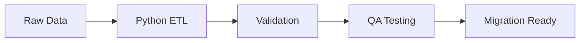

<div align="center">

# ISHIKA BHATTARAI

### `extract → transform → validate → migrate`

**Data Migration · Quality Assurance · Python Automation**

</div>

---

```sql
SELECT role, focus, technologies
FROM developer_profile
WHERE username = 'Ishika-user';
```

| FIELD | VALUE |
|---|---|
| **Role** | Data Migration & QA Intern |
| **Focus** | ETL, Data Quality and Automation |
| **Languages** | Python, SQL and Java |
| **Database** | Microsoft SQL Server |
| **Testing** | Pytest and Data Reconciliation |
| **Location** | Nepal |

## Current Pipeline



## Selected Work

### [`member-data-automation`](https://github.com/Ishika-user/member-data-automation)

```text
INPUT        38 synthetic records
CLEANED      30 records
REVIEW       6 records
DUPLICATES   2 removed
TESTS        54 passed
QA STATUS    PASSED
```

A Python automation system for Excel extraction, data cleaning, duplicate handling, validation, reconciliation, QA reporting, and optional SQL Server loading.

## Toolkit

```text
LANGUAGES    Python · SQL · Java
DATA         Pandas · Excel · OpenPyXL
DATABASE     SQL Server · SQLAlchemy · PyODBC
TESTING      Pytest · Reconciliation · Validation
TOOLS        Git · GitHub · VS Code · SSMS
```

## Current Focus

```python
current_focus = [
    "Python automation",
    "ETL development",
    "Data migration",
    "QA automation",
    "SQL Server"
]
```

---

<div align="center">

[`GitHub`](https://github.com/Ishika-user) · [`LinkedIn`](ADD_YOUR_LINKEDIN_LINK)

<sub>Reliable data begins with reliable validation.</sub>

</div>
